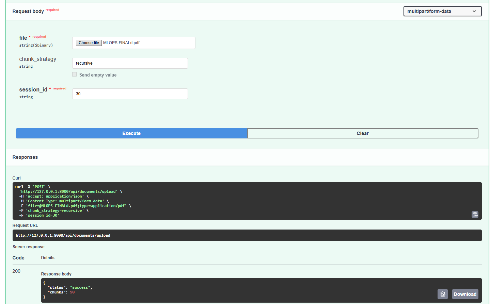
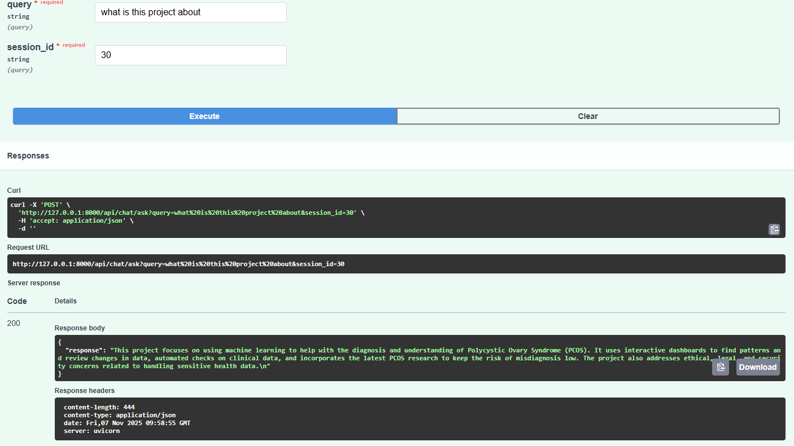

# Custom RAG — Backend Task

This repository contains a backend implementation for a small Retrieval-Augmented
Generation (RAG) system used in a take-home task. The implementation focuses on
server-side components only (no UI) and includes:

- Document ingestion (PDF / TXT) with chunking and embeddings
- Vector storage support (Qdrant) and example configuration
- Conversational RAG API with Redis-based memory and multi-turn support
- Interview booking via LLM-powered extraction (name, email, date, time)
- Docker Compose for Postgres, Qdrant, and Redis for local development

This README describes how to get the dev environment running, where to
configure keys, and how to exercise the main pieces quickly.

## Prerequisites

- Python 3.10+ (recommend using a venv or conda environment)
- Docker & Docker Compose (modern Docker CLI uses `docker compose ...`)
- (Optional) An LLM API key (Gemini) and/or local Ollama/embedding service

On Windows with PowerShell you can create a venv like:

```powershell
python -m venv .venv
.\.venv\Scripts\Activate.ps1
pip install -r requirements.txt
```

If you prefer Conda:

```powershell
conda create -n ragenv python=3.10 -y
conda activate ragenv
pip install -r requirements.txt
```

## Environment variables

Create a `.env` file at the project root (or export values in your shell). The
project expects at least the following environment variables to be set:

- `GEMINI_API_KEY` — your Google Generative Language (Gemini) key (used for
	parsing bookings and assistant replies). If omitted, the booking parser falls
	back to a regex-based extractor.
- `OLLAMA_EMBED_MODEL` / local embedding service — if you run an Ollama or other local
	embedding model; otherwise the embedder can be swapped to remote services.
- GEMINI_API_KEY=your_gemini_api_key_here
- OLLAMA_EMBED_MODEL=your_local_or_remote_embedding_model
```
- POSTGRES_URL=your_postgres_connection_url
- QDRANT_URL=your_qdrant_instance_url
- REDIS_HOST=your_redis_host
```
You may also want to override Postgres credentials used by `docker-compose.yml`.

## Start supporting services (Docker Compose)

The repository includes `docker-compose.yml` that launches:

- Postgres (5432)
- Qdrant (6333)
- Redis (6379)

From the project root run (PowerShell):

```powershell
docker compose up -d
```

To stop and remove containers:

```powershell
docker compose down
```

Check service health with:

```powershell
docker compose ps
docker compose logs -f
```

Notes:
- Default Postgres credentials in the compose file are `rag_user` / `changeme`.
	Change these for production or move them into a `.env` file.
- Qdrant listens on HTTP port `6333` (vector API) and persists data to a
	Docker volume named `qdrant_storage`.

## Running the backend

The codebase exposes a FastAPI backend. To run it locally (from the project
root):

```powershell
# from repo root
uvicorn app.main:app --reload --host 0.0.0.0 --port 8000
```

The actual import path for the FastAPI app may vary (e.g., `app.main` or
`backend.main`) — run `uvicorn` using the module where the FastAPI `app` object
is defined. If you run into import errors, ensure your working directory is the
project root so Python resolves `app` as a package.

## Key components

- `app/services/chunker.py` — custom sentence-aware chunker (supports
	`small` and `recursive` strategies). Use this to split documents before
	creating embeddings.
- `app/services/rag_pipeline.py` — the central pipeline for handling chat
	queries, embedding the user query, retrieving context from `vector_db`, and
	calling the LLM. This file also contains the LLM-based booking extractor used
	to parse and store booking info.
- `app/core/vector_client.py` — client wrapper for Qdrant (or other vector DB).
- `app/core/redis_client.py` — small wrapper to save/retrieve chat memory to
	Redis for multi-turn conversations.
- `docker-compose.yml` — dev stack for Postgres, Qdrant, Redis.

## API usage (examples)

The repository includes APIs for document ingestion and conversational RAG.
Endpoint paths may vary; here are general examples that will work once the
FastAPI app is running and routes are mounted at `/api`:

1) Ingest a document (PDF or TXT)

```powershell
curl -X POST "http://localhost:8000/api/documents/ingest" -F "file=@mydoc.pdf"
```

2) Send a chat message (multi-turn conversation)

```powershell
curl -X POST "http://localhost:8000/api/chat" -H "Content-Type: application/json" -d '{"session_id": "abc123", "query": "What is in the docs?"}'
```

3) Book an interview via chat (LLM will extract fields automatically)

```powershell
curl -X POST "http://localhost:8000/api/chat" -H "Content-Type: application/json" -d '{"session_id": "abc123", "query": "Please book interview for name is Alice; email alice@example.com on 2025-11-10 at 14:30"}'
```

The `rag_pipeline.parse_booking` function will call Gemini and expect a JSON
response containing name/email/date/time (and will fall back to a regex-based
extractor if the LLM is unavailable).

Note: adjust routes and payloads to match the actual FastAPI route handlers in
`app/api/*.py` if they differ.

## Running the chunker demo

There is a small self-test in `app/services/chunker.py`. Run it to see how the
two chunking strategies behave:

```powershell
python .\app\services\chunker.py
```

## Tests and linting

If you add tests (recommended), use pytest. Example:

```powershell
pip install pytest
pytest -q
```

## Troubleshooting

- If you see import errors like `Import "app.services..." could not be resolved`:
	- Ensure you run commands from the project root and your Python path includes
		the project directory.
	- Activate the virtualenv before running `uvicorn` or executing modules.
- If Gemini responses are empty or the shape changes, the code includes robust
	parsing but you may need to inspect `resp.json()` and adapt the extractor in
	`app/services/rag_pipeline.py`.
- If Qdrant is not reachable, check `docker compose ps` and the container logs.

## Next steps and improvements

- Add unit tests for the chunker and booking parser (LLM and fallback).
- Make external HTTP calls asynchronous (use httpx.AsyncClient) so the FastAPI
	event loop isn't blocked by synchronous requests.
- Add migrations and models for Postgres (if not already present), and provide
	a DB initialization script.
- Add a small script to wait for services (Postgres, Qdrant, Redis) before
	starting the backend in docker-compose workflows.

# Upload document


# Chat with Rag Info


## Contact

If you have questions about this implementation or need help running the
project, open an issue or contact the repository owner.

